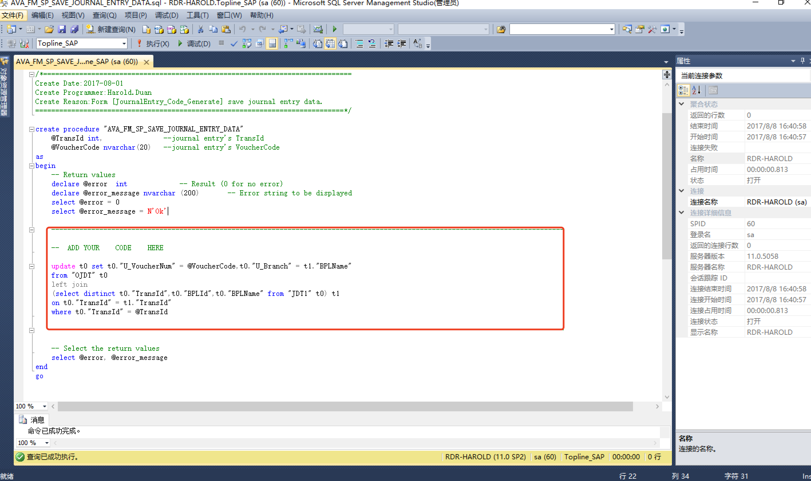
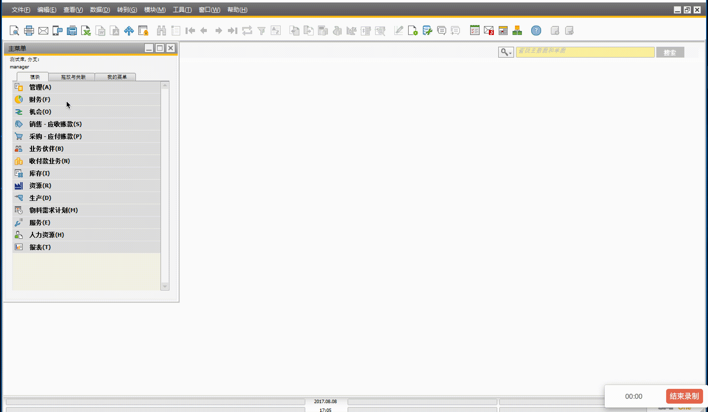

# Pokit 💩

***Pokit means Poo Toolkits!***

## 安装 | Install

## 配置 | Configuration

   ### JournalEntry_Code_Generate | 日记账凭单编码生成
   1. 导入表结构文件(.xml)
   

   2. 导入SQL脚本(.sql)
      + 执行SQL脚本代码
      
      + 修改SQL脚本代码(增加自主逻辑)
      用户可以在sql脚本中增加自己的代码
      
   
   3. 部署格式化搜索逻辑
   

## 使用 | Use

   ### JournalEntry_Code_Generate | 日记账凭单编码生成
   

## 关于 | About
***对于兹软件有兴趣的朋友可以随时到以下网站下载最新的版本，作者会适时更新。***  
[Download Address](https://github.com/haroldduan/BoAddon_Pokit/releases "Pokit Download") 
***对于兹软件有更多的需求与意见请登录下述作者的GitHub或Blog留言，谢谢。*** 

## 作者 | Author
[Mr.Ximen GitHub](https://github.com/haroldduan "GitHub") 
[Mr.Ximen Blog](https://haroldduan.github.io/ "Blog") 

## 鸣谢 | Thanks
[民间盗号组织领导人](https://github.com/HackingGroup "MBs") 
[Color-Coding](https://github.com/color-coding "SBs") 